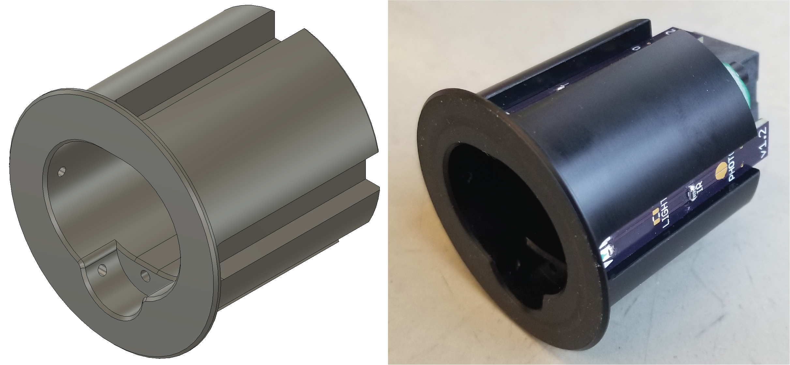

.. Nosepoke documentation master file, created by
   sphinx-quickstart on Thu Nov 15 14:59:53 2018.
   You can adapt this file completely to your liking, but it should at least
   contain the root `toctree` directive.

Nosepoke Documentation
======================

This is the documentation for building a nosepoke for rat behavioral experiments.
It has the following features:

- Deep port for the rat to comfortably insert its nose
- Small shelf for liquid reward to accumulate instead of dripping
- Push-to-connect tube fitting for easily connecting/disconnecting liquid reward source
- Overhead LED for lighting up the inside of the nosepoke
- Two infrared beam breaks for detecting nose insertion and licking
- Electronics that can be easily scaled to larger quantities (single sided PCB with surface mount parts)
- Zero exposed wires, all connections are integrated in the PCB or made with strong solder joints.

This project was developed by Andy Lustig in the `Karpova Lab <https://www.janelia.org/lab/karpova-lab>`_ at Janelia Research Campus

.. toctree::
   :maxdepth: 2
   :hidden: 
   
   nosepoke.rst

