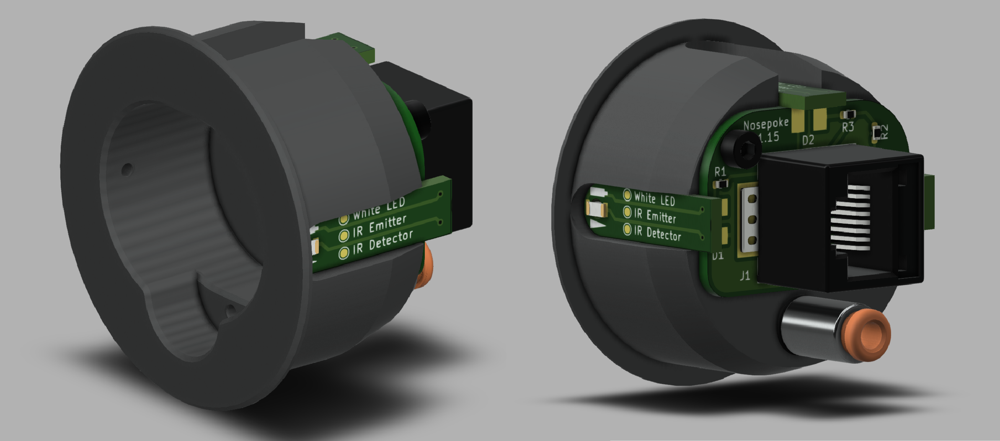

# Overview

    <a href="https://a360.co/349jTLC ">
        
        </img>
    </a>






This is the documentation for building and using a nosepoke.
This project was developed in the [Karpova Lab](https://www.janelia.org/lab/karpova-lab) at HHMI's Janelia Research Campus for use in rodent behavioral experiments.

## Features

**Useful interface for rat**
  - Controllable overhead LED for lighting up the inside of the nosepoke
  - Infrared beam break for detecting nose insertion
  - Shelf for liquid reward to accumulate instead of dripping onto floor

**Easy installation and maintenance**
  - Designed to be press fit into 1.5" hole for easy installation and removal
  - Backside push-to-connect tube fitting for quick connection/disconnection when replacing liquid reward tubing

**Robust and manufacturable**
  - Designed to be machined out of hard plastic or aluminum by a typical machine shop. A less durable version could be 3D printed
  - Zero exposed wires, all connections are integrated into the PCB or made with solder joints. 
    - Removes possibility of connections coming loose or wires becoming damaged over time.
  - Electronics can be easily scaled to larger quantities
    - Single sided PCB with surface mount components is ideal for a PCB assembly service or manual assembly with a toaster oven/hot plate/heat gun.

**Open source**

  - All files are available on [GitHub](https://github.com/Karpova-Lab/nosepoke) and can be modified to meet custom needs
